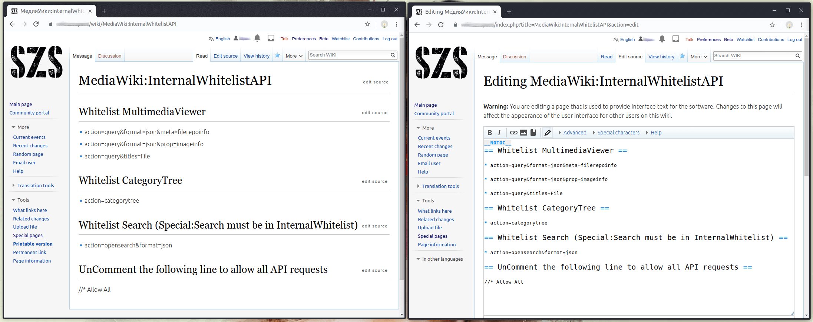

# PrivateWikiAccessControl

This project aimed to help you to make your MediaWiki More Private, also it provides you the capability to Whitelist a Certain Content in a convenient way.

Before we begin, let's talk about what actually happens when you [make your wiki private](https://www.mediawiki.org/wiki/Manual:Preventing_access):

1. The users that are not logged in can't see the content of the pages of your wiki, unless some pages are not whitelisted, by the [`$wgWhitelistRead`](https://www.mediawiki.org/wiki/Manual:$wgWhitelistRead) array. But if you want to allow (deny) public access to some page you will need to edit your [`LocalSettings.php`](https://www.mediawiki.org/wiki/Manual:LocalSettings.php) file.

2. Your files (images, pdfs, etc.) will be accessible for anyone who have their full URL.

3. Your MediaWiki API will deny access to any data unless you authenticate yourself. Thus the users that are not logged in can't get any data, no matter certain page is whitelisted or not - i.e. the Extension:CategoryTree (and some other extensions) will not work on the pages that you've decided to be whitelisted.

In order to provide more control in all of these aspects here wi will apply the following components:

1. The MediaWiki **Extension:PrivateWikiAccessControl**, that allows you a convenient way to whitelist pages.

2. **Whitelist API**, that comes with the Extension:PrivateWikiAccessControl and will handle the API requests made by not logged in users, also will allow access only to the whitelisted files (images, pdfs, etc.).

3. Additional **Apache2's Virtual Host Configuration**, that will allow you to manage the users request depending on the users are logged in or not.

## Extension:PrivateWikiAccessControl

### Installation

````bash
cd $IP/extensions
sudo git clone https://github.com/pa4080/mw-PrivateWikiAccessControl.git PrivateWikiAccessControl # HTTPS
sudo git clone git@github.com:pa4080/mw-PrivateWikiAccessControl.git PrivateWikiAccessControl     # SHH
````

### LocalSettings.php Setup

Add the following code at the bottom of your `LocalSettings.php`:

````php
// Extension:PrivateWikiAccessControl Settings
wfLoadExtension( 'PrivateWikiAccessControl' );
$wgWhitelistRead = unserialize(file_get_contents("$IP/cache/PWAC_WhitelistPages.txt"));

// API:PrivateWikiAccessControl Settings
$wgPWAC['WhitelistApiUser'] = 'User@PrivateWikiAccessControlBot';
$wgPWAC['WhitelistApiPass'] = '...the.password.of.the.bot...';
# $wgPWAC['WhitelistWalk'] = 'add';        // acceptable values: add, remove
# $wgPWAC['WhitelistApiLog'] = 'disable';  // only this value is acceptable
````

When it is enabled, the **Extension:PrivateWikiAccessControl** will read the MediaWiki message pages `MediaWiki:InternalWhitelist` and `MediaWiki:InternalWhitelistAPI` and on their base will generate two arrays stored in the wiki's cache directory (so it must be writable by the Apache's user `www-data`). The extension will create and a third file where the configuration array `$wgPWAC[]` will be stored. These files will be overwritten only when a new entry (within the mentioned places) is made.

### MediaWiki:InternalWhitelist > $IP/cache/PWAC_WhitelistPages.txt

The content of the page `MediaWiki:InternalWhitelist` will be stored as serialized array in the file `$IP/cache/PWAC_WhitelistPages.txt`. After that, when some page is loaded the content of this file will be assigned to `$wgWhitelistRead` via `Localsettings.php`. Thus your pages will be whitelisted.

It is no longer possible (I think since MW 1.33) to change the value of `$wgWhitelistRead` within an extension and this is the reason why the [Extension:InternalWhitelist](https://www.mediawiki.org/wiki/Extension:InternalWhitelist) no longer works.

When `MediaWiki:InternalWhitelist` is read, all lines that doesn't start with one or more wildcards (`* Page_name`) will be ignored. Sou you can add comments and headings inside that page.

The **Extension:PrivateWikiAccessControl** is equipped with the script **`PrivateWikiAccessControlManager.js`** that adds an menu item within the dropdown menu `<More>`. Note you may need to load a new page in order to apply and see the changes.


When the page `MediaWiki:InternalWhitelist` doesn't exist the script will create it automatically.

You can edit `MediaWiki:InternalWhitelist` manually but you need to use the syntax shown below, otherwise the script will not be able to handle your entries. Example content of `MediaWiki:InternalWhitelist`:

````text
== Whitelist scripts and Special pages ==

* [[:МедияУики:Common.css]]

* [[:МедияУики:Common.js]]

* [[:МедияУики:Vector.css]]

* [[:МедияУики:Vector.js]]

* [[:Special:Search]]

== Whitelist Content Pages ==

* [[:Main_page]]

* [[:Some_page]]

* [[:File:Some_image.png]]
````


You can use `$wgPWAC['WhitelistWalk'] = 'add/remove';` within `LocalSettings.php` in order to *add* (or *remove*) pages to the whitelist while browsing your wiki.

### MediaWiki:InternalWhitelistAPI > $IP/cache/PWAC_WhitelistApi.txt

The content of the page `MediaWiki:InternalWhitelistAPI` will be stored as serialized array in the file `$IP/cache/PWAC_WhitelistApi.txt`. These entries will be used by `PrivateWikiAccessControl.api.php` as filter of allowed API requests. How to redirect some requests to that API will be described in the section "Apache2 Setup".

When `MediaWiki:InternalWhitelistAPI` is read, all lines that doesn't start with one or more wildcards (`* action=query&...`) will be ignored. Sou you can add comments and headings inside that page.

You need to create that page `MediaWiki:InternalWhitelistAPI` manually. Otherwise when the page is not created (or it is empty) all API requests will be allowed. You are able to allow all API requests also by adding the entry `* Allow All` in `MediaWiki:InternalWhitelistAPI`, this is good option for test purposes. Example content of `MediaWiki:InternalWhitelistAPI`:

````text
__NOTOC__
== Whitelist MultimediaViewer ==

* action=query&format=json&meta=filerepoinfo

* action=query&format=json&prop=imageinfo

* action=query&titles=File

== Whitelist CategoryTree ==

* action=categorytree

== Whitelist Search (Special:Search must be in InternalWhitelist) ==

* action=opensearch&format=json

== UnComment the following line to allow all API requests ==

//* Allow All
````



By default `PrivateWikiAccessControl.api.php` will write the log file `$IP/cache/PWAC_Api.log` that contains all API queries made to it (the maximum size of the log file is 100 Kb). By the following command you can debug which API requests you want to whitelist.

````bash
tail -F ../../cache/PWAC_Api.log
````

If you want to disable logging you can add `$wgPWAC['WhitelistApiLog'] = 'disable';` in your `LocalSettings.php`.

### $wgPWAC[] > PWAC_Conf.txt

In the beginning of `PrivateWikiAccessControl.hooks.php` you can see all possible parameters that can be tweak from within `LocalSettings.php`. At all, the parameters that you need to set are:

````php
// API:PrivateWikiAccessControl Settings
$wgPWAC['WhitelistApiUser'] = 'User@PrivateWikiAccessControlBot';
$wgPWAC['WhitelistApiPass'] = '...the.password.of.the.bot...';
# $wgPWAC['WhitelistWalk'] = 'add';        // acceptable values: add, remove
# $wgPWAC['WhitelistApiLog'] = 'disable';  // only this value is acceptable
````

The options `$wgPWAC['WhitelistWalk']` and `$wgPWAC['WhitelistApiLog']` are described above.

`$wgPWAC['WhitelistApiUser']` and `$wgPWAC['WhitelistApiPass']` are required! Otherwise our API can't authenticate ot the MediaWiki's API and the mechanism will not work at all. For user and password you can fill the authentication data of any user, but according to our needs, I will recommend you to use [`Special:BotPasswords`](https://www.mediawiki.org/wiki/Manual:Bot_passwords) in order to create a Bot with *Basic rights* (which is able only to read dat from the API).


The file `PWAC_Conf.txt` is used by `PrivateWikiAccessControl.api.php`, thus the API will get our settings. Note if wou want to change the path to the cache directory within `LocalSettings.php` (default: `$wgPWAC['CacheDir'] = "$IP/cache";`) you will need to edit the beginning of `PrivateWikiAccessControl.api.php`, otherwise the API can't get our settings.

## API:PrivateWikiAccessControl

`PrivateWikiAccessControl.api.php` reads its settings from the file `$IP/cache/PWAC_Conf.txt`, so as we said above it must know which is the location of that file. When we call that API a GET request must be provided, otherwise it will redirect to the homepage of the wiki. The API has two main functional parts:

1. `PrivateWikiAccessControl.api.php` will allow access of the anonymous (not logged in) users to the files (images, pdfs, etc.), that belongs to `MediaWiki:InternalWhitelist`. In order to add a file to that list you need to whitelist itd page (`File:Some_file_name`).

   This functionality is triggered by the GET request parameter `imgIWL=`, that will be assigned within the Apache2's virtual host configuration. How to redirect files/images requests (of the anonymous users) to that API will be described in the section "Apache2 Setup".

   It will show ony these the image types that are listed in the array `$imgIWL_ContentTypes`, that currently is hard-coded inside the API.

2. `PrivateWikiAccessControl.api.php` will allow access of the anonymous (not logged in) users to the MediaWiki's API, only in case the beginning of the requests is presented in `MediaWiki:InternalWhitelistAPI` (or when the value `Allow All` is provided in this page ot it is empty, as it is described above).

   In order to determinate which api requests you need to Whitelist, you need to analyze `$IP/cache/PWAC_Api.log`, as it is described above, note the logging *disable* option must be turned off:

   ````php
   $wgPWAC['WhitelistApiLog'] = 'enable'; // or just comment-out the relevant line
   ````

    In order to get this functional part of the api operational, as it is described above, within `LocalSettings.php` you need to provide:

    ````php
    $wgPWAC['WhitelistApiUser'] = 'User@PrivateWikiAccessControlBot';
    $wgPWAC['WhitelistApiPass'] = '...the.password.of.the.bot...';
    ````

    In oder to authenticate itself to the MediaWiki API, our Whitelist API will write and use an authentication cookie in the file `$IP/cache/PWAC_Api.cookie`. For more details [MW:API:Login](https://www.mediawiki.org/wiki/API:Login).

## Apache2 Setup

The Apache's configuration must be made at the Virtual Host level, this is because the `Alias` directives, that are essential for our mechanism. Here is an example Apache's configuration:

````apache
<VirtualHost ...>

    # Other configuration directives...

    # Define variables for 'DocumentRoot' and the wiki's database name,
    # because thy will be used several times
    #
    Define wikiDocumentRoot "/var/www/your.wiki.document.root.directory"
    Define wikiDBName "your_wiki_db_name"

    DocumentRoot "${wikiDocumentRoot}"
    <Directory "${wikiDocumentRoot}">
            Options None FollowSymLinks
            AllowOverride All
            Require all granted
    </Directory>

    # PrivateWikiAccessControl implementation
    #
    # '${wikiDBName}' - is the database name of this wiki, it is used as cookie parameter.
    # 'action=(categorytree|query&format|query&titles)' - regex of whitelisted api queries.
    #
    # "/wl.api.php" - the url of our Whitelist API where the anonymous user's requests will be redirected
    # "/mw.api.php" - the url of MediaWiki API where our Whitelist API will make the requests
    #
    # The expression '${wikiDBName}UserName=[a-zA-Z0-9]+;.*${wikiDBName}UserID=[1-9]+' will match to the cookie
    # of the logged in users. So '!${wikiDBName}UserName=...' will match to the users that are not logged in.
    # This is the main trigger of the request redirections made by anonymous users.

    Alias "/mw.api.php" "${wikiDocumentRoot}/api.php"
    Alias "/wl.api.php" "${wikiDocumentRoot}/extensions/PrivateWikiAccessControl/PrivateWikiAccessControl.api.php"

    <ifModule mod_rewrite.c>
        RewriteEngine On

        # Redirect ony certain requests 'action=(categorytree|query&format|query&titles)' to our Whitelist API.
        # This is additional security lair, that works independently of MediaWiki:InternalWhitelistAPI
        #
        RewriteCond %{HTTP_COOKIE} !${wikiDBName}UserName=[a-zA-Z0-9]+;.*${wikiDBName}UserID=[1-9]+ [NC]
        RewriteCond %{QUERY_STRING} (?:^|&)action=(categorytree|query&format|query&titles|opensearch&format)(?:$|&|=)
        RewriteRule "^/api\.php(.*)$" "/wl.api.php$1" [R]

        # Redirect all requests made by anonymous users to our Whitelist API.
        # Debug/test alternative of the above rules.
        #
        #RewriteCond %{HTTP_COOKIE} !${wikiDBName}UserName=[a-zA-Z0-9]+;.*${wikiDBName}UserID=[1-9]+ [NC]
        #RewriteRule "^/api\.php(.*)$" "/wl.api.php$1" [R]

        # If the request is for image/file and the requested flie/image belongs to the supported file list,
        # then redirect the request to our Whitelist API, by using GET request '?imgIWL=%{REQUEST_URI}'.
        #
        Define imgIWLAllowed "(ogg|pdf|zip|mpeg|wav|gif|jpeg|jpg|png|tiff|djvu|djv|svg|css|cvs|html|txt|xml|mpg|mpeg|mp4|mkv|avi|qt|wmv|webm)"
        RewriteCond %{HTTP_COOKIE} !${wikiDBName}UserName=[a-zA-Z0-9]+;.*${wikiDBName}UserID=[1-9]+ [NC]
        RewriteCond %{REQUEST_URI} ^/images/
        RewriteRule "\.${imgIWLAllowed}$"  "/wl.api.php?imgIWL=%{REQUEST_URI}" [R]
    </ifModule>

    # Other configuration directives...

</VirtualHost>
````

All used directives and rules are well described within the example, so I think no more explanations are needed at this stage.

If it is MediaWiki Family you need to create such configuration for each wiki.

You can send requests directly to `/wl.api.php`. For example within my wikis I'm using [Extension:ExternalData](https://www.mediawiki.org/wiki/Extension:External_Data) in the following way:

````json
{{#get_web_data: url=/wl.api.php?action=query&titles=File%3AЕгипет_1.png&prop=imageinfo&iiprop=size&format=json|format=JSON|data=ext_height=height,ext_width=width}} 
Dimensions: {{#external_value:ext_width}} x {{#external_value:ext_height}}
````

## Created files

As it is explained above, the extension creates and uses the following files in the `$IP/cache` directory:

1. `$IP/cache/PWAC_WhitelistPages.txt` that is based on `MediaWiki:InternalWhitelist`.

2. `$IP/cache/PWAC_WhitelistApi.txt` that is based on `MediaWiki:InternalWhitelistAPI`.

3. `$IP/cache/PWAC_Conf.txt` that contains the configuration array `$wgPWAC[]`, used by our Whitelist API.

4. `$IP/cache/PWAC_Api.cookie` used by our Whitelist API in order to do authentication to MediaWiki's API.

5. `$IP/cache/PWAC_Api.log` debug log written by our Whitelist API.

## Hooks 

* [ResourceLoaderGetConfigVars](https://www.mediawiki.org/wiki/Manual:Hooks/ResourceLoaderGetConfigVars)

* [BeforePageDisplay](https://www.mediawiki.org/wiki/Manual:Hooks/BeforePageDisplay)

## References

| MediaWiki | Apache2 |
| ---       | ---     |
| [Manual:Extension Registration](https://www.mediawiki.org/wiki/Manual:Extension_registration) | [Mod Alias](https://httpd.apache.org/docs/2.4/mod/mod_alias.html) |
| [Manual:Developing Extensions](https://www.mediawiki.org/wiki/Manual:Developing_extensions) | [Mod Rewrite Intro](https://httpd.apache.org/docs/2.4/rewrite/intro.html) |
| [Manual:Hooks](https://www.mediawiki.org/wiki/Manual:Hooks) | [Mod Rewrite Flags](https://httpd.apache.org/docs/2.4/rewrite/flags.html) |
| [Manual:Interface](https://www.mediawiki.org/wiki/Manual:Interface) [/JavaScript](https://www.mediawiki.org/wiki/Manual:Interface/JavaScript) | __Not used__ |
| [Manual:Messages API](https://www.mediawiki.org/wiki/Manual:Messages_API) | [Mod Rewrite Rewrite Map](https://httpd.apache.org/docs/2.4/rewrite/rewritemap.html) |
| [Manual:$wgResourceModules](https://www.mediawiki.org/wiki/Manual:$wgResourceModules) | [Need help setting up a redirect map](https://www.sitepoint.com/community/t/need-help-setting-up-a-redirect-map/39049/2)
| [ResourceLoader](https://www.mediawiki.org/wiki/ResourceLoader)
| [Best practices for extensions](https://www.mediawiki.org/wiki/Best_practices_for_extensions)
| [Extension:Example](https://www.mediawiki.org/wiki/Extension:Example)
| [API:Main page](https://www.mediawiki.org/wiki/API:Main_page)
| [Help:Customizing Toolbars](https://en.wikipedia.org/wiki/Help:Customizing_toolbars)

## Credits

* The general idea for internal whitelisting is adopted from the MediaWiki's [Extension:InternalWhitelist](https://www.mediawiki.org/wiki/Extension:InternalWhitelist).
* The icons used by the extension are stolen from [FontAwesome](https://fontawesome.com/icons?d=gallery&q=check).